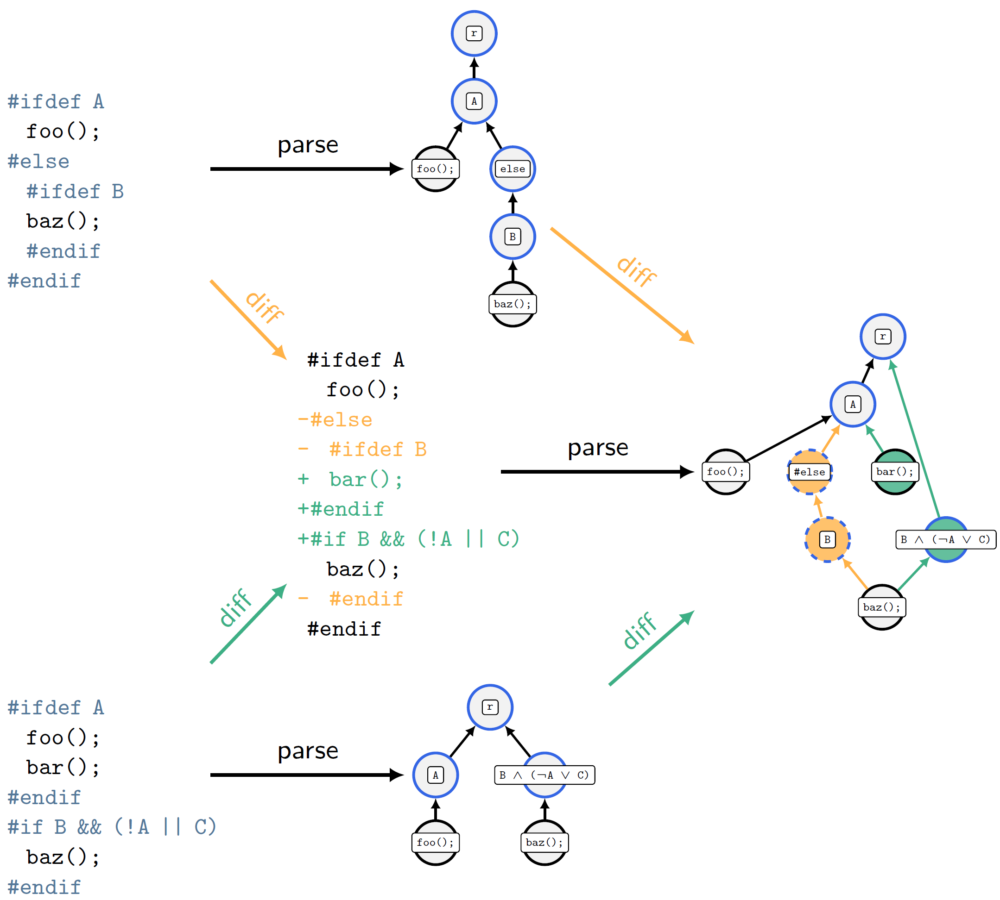

[][documentation]
[][website]

# DiffDetective - Analysing Edits to Preprocessor-Based Variability

DiffDetective is a research software to study the evolution of configurable and variational software projects, also known as software product lines.

DiffDetective reads the Git history of a C-preprocessor-based software product line to analyze patches in terms of _variation diffs_ [1].
A variation diff is a variability-aware diff that depicts changes to source code as well as to variability annotations (e.g., C-preprocessor macros such as `#if` and `#ifdef`).

This figure outlines the parsing process within DiffDetective.
Given two states of a C-preprocessor annotated source code file (left), for example before and after a commit, DiffDetective constructs a variation diff (right) that describes the differences of the code as well as the involved variability.
DiffDetective can construct a variation diff either from a text-based diff between both file versions (center path),
or by first parsing both versions to an abstract representation, a variation tree (center top and bottom), and constructing a variation diff using a tree matching algorithm in a second step.

## Publications

### [2] Views on Edits to Variational Software (SPLC 2023)

> P. M. Bittner, A. Schultheiß, S. Greiner, B. Moosherr, S. Krieter, C. Tinnes, T. Kehrer, T. Thüm. _Views on Edits to Variational Software_. Conditionally Accepted at the 27th ACM International Systems and Software Product Line Conference (SPLC 2023)

In this work, we used DiffDetective for a feasibility study of creating views on edits to C-preprocessor based software.
The idea of a view is to act as a filter on relevant parts of a system.
For instance, a piece of source code may be deemed relevant if it implements a certain feature.

Views on edits extend views to software changes.
A view on an edit thus is a simplified form of an edit that, for example, contains only changes to a certain feature.
We implemented views on edits for variational systems in terms of views on variation diffs.

Our replication package and further information can be found in the [README](replication/splc23-views/README.md) file in the respective directory (`replication/splc23-views`).

### [1] Classifying Edits to Variability in Source Code (ESEC/FSE 2022)

> P. M. Bittner, C.Tinnes, A. Schultheiß, S. Viegener, T. Kehrer, T. Thüm. _Classifying Edits to Variability in Source Code_. In Proceedings of the 30th ACM Joint European Software Engineering Conference and Symposium on the Foundations of Software Engineering (ESEC/FSE 2022), ACM, New York, NY, November 2022

In this work, we used DiffDetective to classify the effect of edits on the variability of the edited source code in the change histories of 44 open-source C-preprocessor-based software projects.

Our replication package and further information can be found in the [README](replication/esecfse22/README.md) file in the respective directory (`replication/esecfse22`).

[documentation]: https://htmlpreview.github.io/?https://github.com/VariantSync/DiffDetective/blob/splc23-views/docs/javadoc/index.html
[website]: https://variantsync.github.io/DiffDetective/
